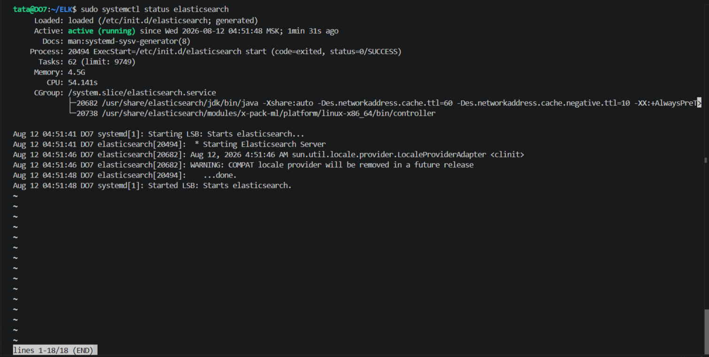
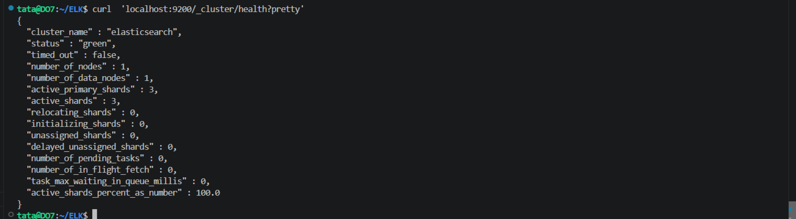
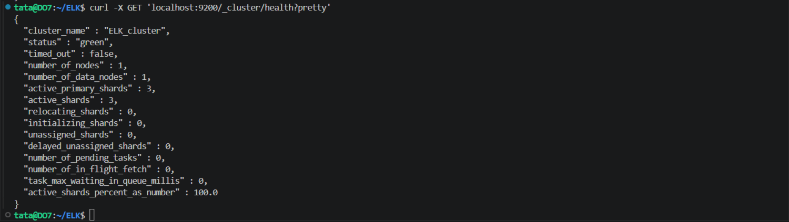
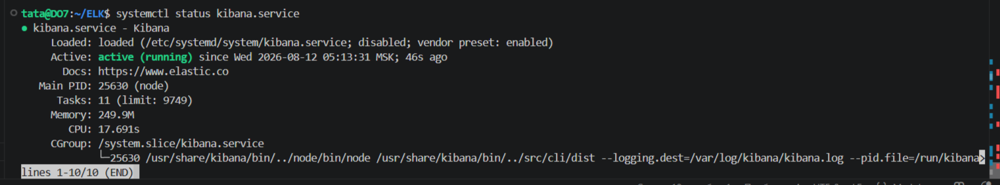
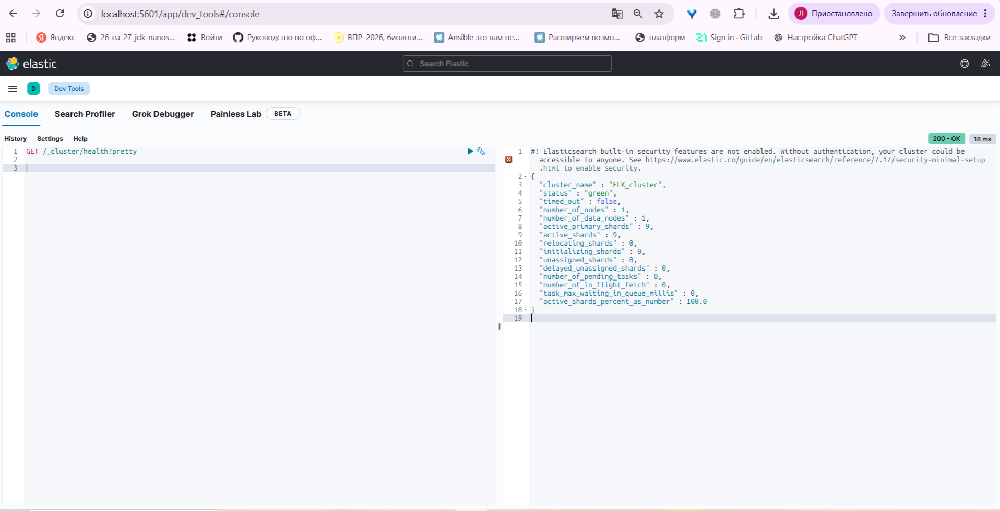
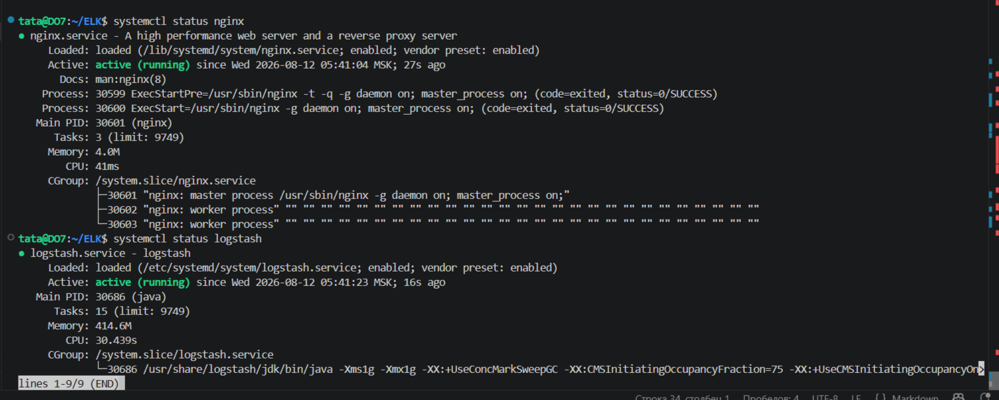
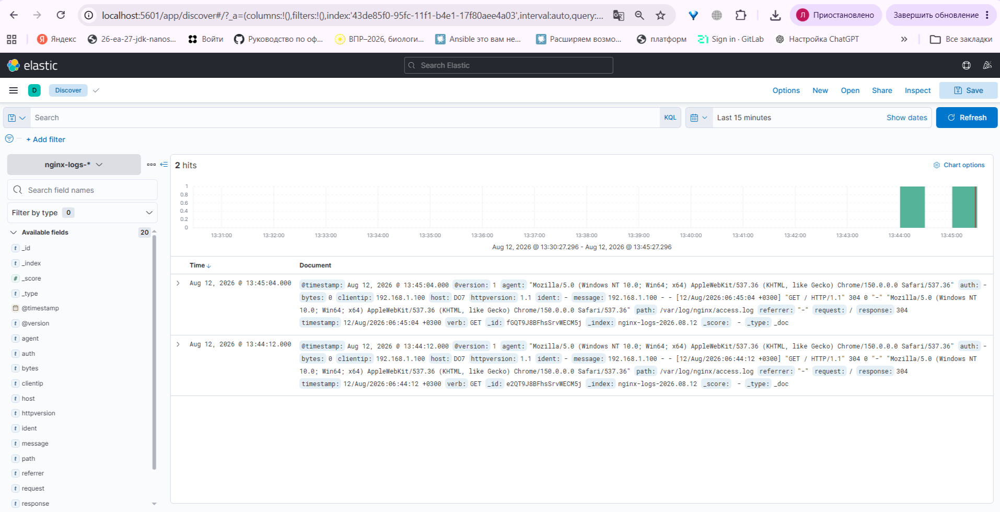
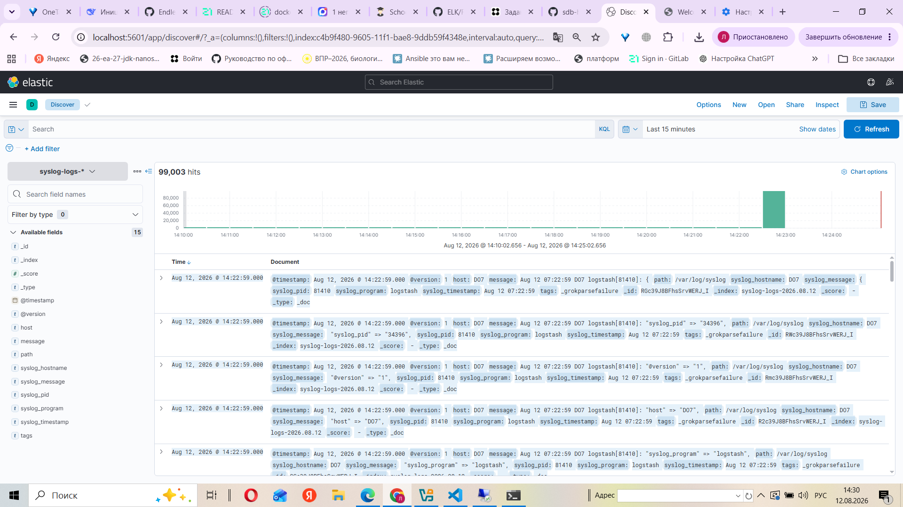
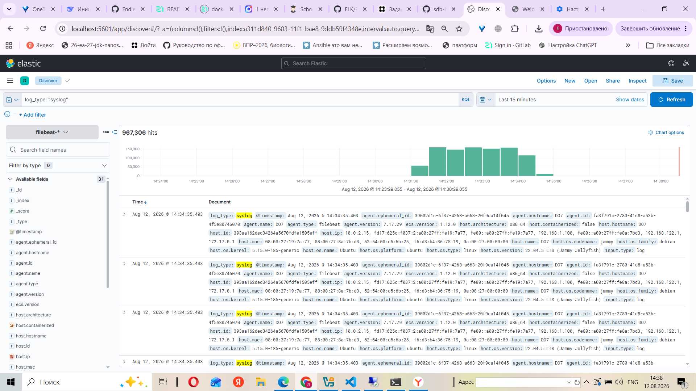

# Домашнее задание к занятию "ELK" - Фабричникова Татьяна Александровна

## Задание 1. Elasticsearch

Установите и запустите Elasticsearch, после чего поменяйте параметр cluster_name на случайный.

>Служба запущена

>Сервер запущен

>Заменила имя кластера в файле elasticsearch.yml

## Задание 2. Kibana

Установите и запустите Kibana.

>Запущенная служба

>Запрос в Kibana

Приведите скриншот интерфейса Kibana на странице http://<ip вашего сервера>:5601/app/dev_tools#/console, где будет выполнен запрос GET /_cluster/health?pretty.

## Задание 3. Logstash

Установите и запустите Logstash и Nginx. С помощью Logstash отправьте access-лог Nginx в Elasticsearch.

>Запущенные службы logstash и nginx

Приведите скриншот интерфейса Kibana, на котором видны логи Nginx.

>Логи nginx

## Задание 4. Filebeat.

Установите и запустите Filebeat. Переключите поставку логов Nginx с Logstash на Filebeat.

>Запущенная служба filebeat

>Логи nginx c filebeat

Приведите скриншот интерфейса Kibana, на котором видны логи Nginx, которые были отправлены через Filebeat.

## Задание 5*. Доставка данных

Настройте поставку лога в Elasticsearch через Logstash и Filebeat любого другого сервиса , но не Nginx. Для этого лог должен писаться на файловую систему, Logstash должен корректно его распарсить и разложить на поля.

Соберем системные логи syslog, для logstash необходимо написать еще один конфигурационный файл, и в kibana создать индекс 'syslog-logs-*'

>Логи syslog c logstash

Для filebeat меняем в filebeat.yml путь сбора логов, перезапускаем службу.

>Логи syslog c filebeat

Приведите скриншот интерфейса Kibana, на котором будет виден этот лог и напишите лог какого приложения отправляется.

